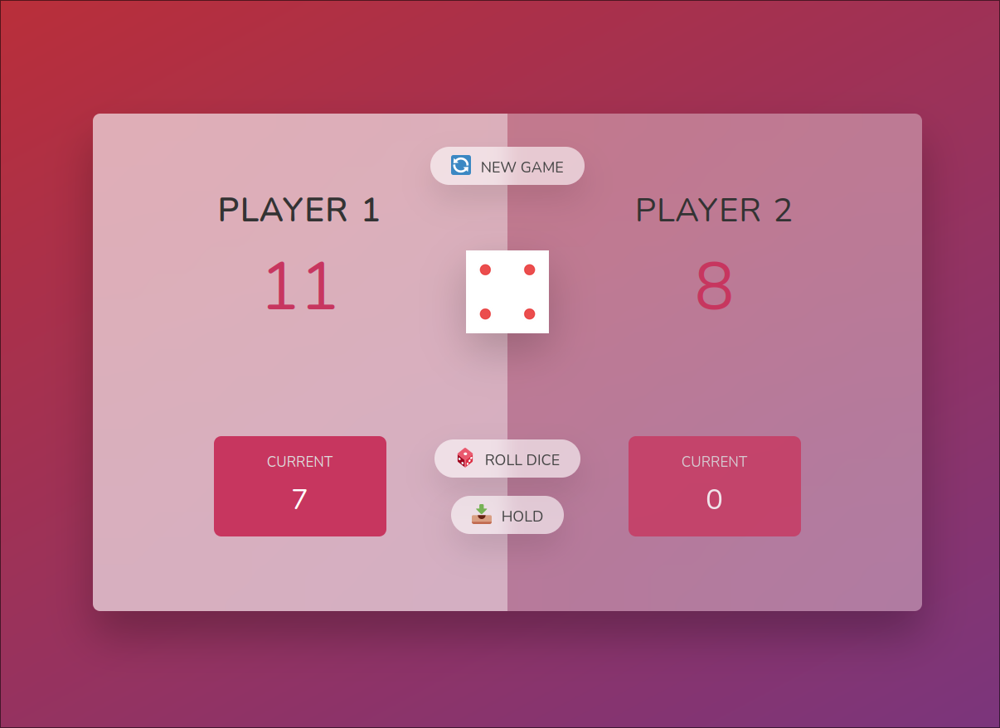
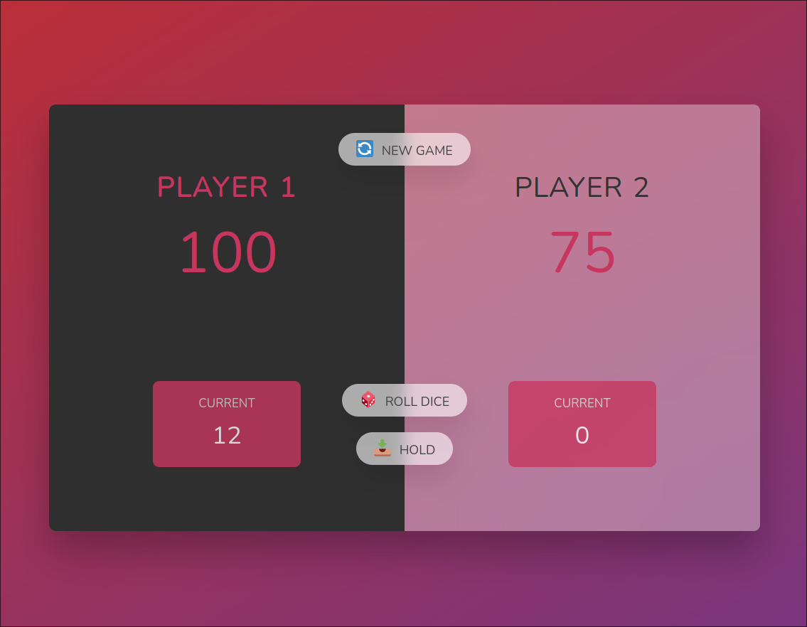

# Pig Game

A one-page game using pure javascript.

## Rules:

- A player's turn consists of rolling the die until a 1 is rolled. In this case, the player's points earned during the turn are not counted.
- The player can stop and pass the turn to the next player. In this way, he will keep the points he earned during that turn.
- A player must score 100 points to win.

## Showcase:

- **Gameplay**:
  

- **Player's victory**:
  
